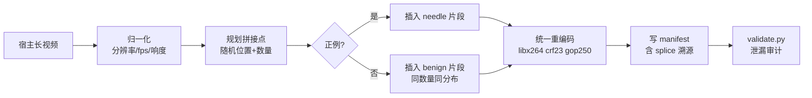

# 02 · 数据集构建

格式规范见 `../SPEC.md`（已冻结 v1.0）。本文讲**怎么造出来**。

## 1. 三个子集，职责不同

| 子集 | 来源 | 规模目标 | 作用 |
|---|---|---|---|
| **SG2-Synth** | 合成（拼接） | ~6000 条 | 主力。受控 ν、受控难度因子 |
| **SG2-Native** | 原生长视频 | ~400 条 | 外部效度验证。零拼接痕迹 |
| **SG2-Context** | 原生，语境型 | ~300 条 | 上下文依赖轴**必须**原生 |

规则（第 9 轮结论）：**needle 自足的轴用合成；伤害依赖语境的轴必须原生。**
语境型伤害一拼接就把要测的东西毁了。

## 2. 素材来源

### 2.1 宿主视频（长 benign）
- Internet Archive 的 CC / 公共领域长录像
- YouTube CC-BY 长直播回放（需存 URL+时间戳而非内容，见 §6）
- 已有素材：`/data/common/haibotong/tiktok_material/`（短，仅够做插入片段）

要求：时长 ≥ 20 min，有音轨，画面多样（避免全是静态讲话头）。

### 2.2 Needle 片段（unsafe）
- **SafeWatch-Bench**（分类体系也继承自它，见 §5）
- StreamGuard 1.0 的 Safe2Shot：4K+ unsafe 视频、**帧级标注** ← 关键，直接给 ν
- AdvVideo-Bench：对抗子集

⚠️ 用前必须核实两件事：**标注粒度是否带时间戳**（只有视频级标签给不出 ν），
以及**再分发许可**。

### 2.3 干扰片段（benign，用于对照组）
从同一批宿主视频里切出，与 needle 同长度分布。**这是防泄漏的关键素材**。

## 3. 合成流水线



### 3.1 判据：不是"视频连贯"，是"剪辑痕迹不携带标签信息"

后者便宜得多，也才是正确门槛。真实直播本来就到处是切镜头。具体要求：

1. **正负例都拼接，剪辑数与位置同分布**（`check_splice_balanced` +
   `check_cut_position_leakage` 用置换检验查）
2. **整条统一重编码** —— 压缩域 sentinel 读的就是编码器指纹，不统一等于自埋捷径。
   `Splice(reencoded_uniformly=False)` 构造即报错。
3. 音频交叉淡入 40ms + EBU R128 响度归一（`loudnorm=I=-23`）
4. 边界色彩/曝光匹配
5. 拼接位置、时长、数量全部随机化

### 3.2 ffmpeg 参数（已验证可用：7.0.2 static，含 libx264）

```bash
FFMPEG=$(python -c "import imageio_ffmpeg;print(imageio_ffmpeg.get_ffmpeg_exe())")

# 归一化（宿主与插入片段都要，先统一再拼）
$FFMPEG -i in.mp4 -vf "scale=1280:720:force_original_aspect_ratio=decrease,\
pad=1280:720:(ow-iw)/2:(oh-ih)/2,fps=30" \
  -af "loudnorm=I=-23:LRA=7:TP=-2" \
  -c:v libx264 -crf 20 -preset medium -g 250 -pix_fmt yuv420p \
  -c:a aac -b:a 128k norm.mp4

# 拼接后统一重编码（不要用 -c copy，会保留各片段的编码器指纹）
$FFMPEG -f concat -safe 0 -i list.txt \
  -c:v libx264 -crf 23 -preset medium -g 250 -pix_fmt yuv420p \
  -c:a aac -b:a 128k out.mp4
```

⚠️ **严禁 `-c copy`**。拼接必须重编码，否则各片段的量化参数、GOP 结构差异
会成为与标签相关的捷径。

### 3.3 压缩域特征抽取（不解码成 RGB）

```bash
# 运动矢量
$FFMPEG -flags2 +export_mvs -i in.mp4 -vf codecview=mv=pf+bf+bb -f null -
# 帧类型与码率(逐帧)
ffprobe -select_streams v -show_frames \
  -show_entries frame=pict_type,pkt_size,best_effort_timestamp_time \
  -of csv in.mp4
```

## 4. 切分与规模

### 4.1 切分规则：按**源视频**切，不按片段

同一宿主或同一 needle 源出现在两个 split 会泄漏。`split_by_source()` 先对
`source.provenance` 做分组，再分配。

### 4.2 池与 split 的关系

`pool` 和 `split` 是**正交**的两个字段（SPEC.md §3）：

| pool | split | 用途 |
|---|---|---|
| `exemplar` | train | analyst in-context 示例、case library |
| `compile` | train | prompt/超参（α, β）调优的验证信号 |
| `calibration` | calib | conformal 阈值拟合。**模型不得以任何形式见过** |
| `eval` | test | 最终评测 |
| `eval` | zeroday_holdout | 零日政策实验，整个类别留出 |

### 4.3 规模推算

校准粒度**逐类别**（跨难度 bin 汇总）。逐 cell 校准需要 45×cells 正例，
不可行；逐 cell 只报观测值，不给保证。

设 SafeWatch 有 C≈8 个类别：

| 池 | 每类别正例 | 合计正例 | 负例(3×) | 说明 |
|---|---|---|---|---|
| calibration | **120** | 960 | 2880 | 120 > 45，留出余量允许若干漏报 |
| exemplar | 40 | 320 | 320 | 少样本机制只需几十 |
| compile | 40 | 320 | 960 | 调 α/β |
| eval | 200 | 1600 | 4800 | 逐 cell 拆开后每格仍有样本 |

**正例合计约 3200，负例约 9000，总计约 12000 条。**
其中 2 个类别整体划入 `zeroday_holdout`，不进 exemplar/calibration。

### 4.4 难度轴的因子设计

全因子在 2 个主轴上，其余 2 轴做部分因子（全因子会爆炸）：

- **主轴**：时序稀疏度 (3) × 感知细微度 (3) = 9 格，每类别每格 ≥ 20 条
- **副轴**：模态位点 (5)、上下文依赖 (3) 在 eval 池的子集上分层，不求满格
- **元数据轴**：`aligned` : `fp_bait` : `camouflage` ≈ 6 : 2 : 2

## 5. 分类体系

继承 SafeWatch，**不自造**。`spec/taxonomy/safewatch.json` 目前是占位文件，
需从正式发布抄录类别 id。

类别标签必填，因为四件事没它直接失效：逐类别校准、零日留出、政策条款引用、
"稀有=严重"的非对称预算。但论文头条轴是难度因子，分类只是分层变量。

## 6. 法律与伦理

部分类别根本不能再分发。三种标准做法，按类别选：

| 方式 | 适用 | 代价 |
|---|---|---|
| 发 URL + 时间戳 | 公开平台来源 | 链接会失效，复现性下降 |
| 只发特征/embedding | 高危类别 | 别人无法换编码器复现 |
| 门控访问（申请制） | 中等敏感 | 使用门槛 |

**这会同时是审稿问题和 IRB 问题，而且反过来限制能收哪些类别。**
需要在收数据之前定，不是之后。

## 7. 磁盘预算

| 项 | 估算 |
|---|---|
| 宿主归一化后 720p30，20min | ~250 MB/条 |
| 合成输出 12000 条 × 平均 15min | **~2.2 TB** |
| 抽帧缓存（needle 精确帧） | ~20 GB |
| 压缩域特征 | ~5 GB |

当前 `/data` 剩 67G、`/data2` 剩 49G、`/` 剩 99G，**共约 215G，远远不够**。

缓解顺序：
1. 先只做 **SG2-Synth-mini**（每类别 30 条，共 ~400 条，约 80 GB）跑通全流程
2. 降到 480p / crf 28 可省约 60%
3. 中长期必须申请独立存储
