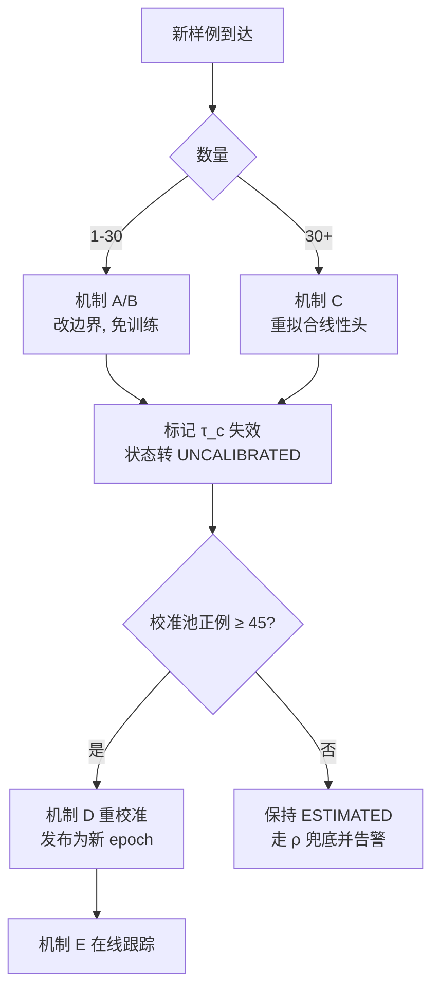

# 03 · 少样本决策边界调整

**目标**：新数据来了，用少量样本就能改变判定边界与判定结果，不重训 backbone。

**核心张力**：移动边界会让已校准的阈值**立刻失效**。少样本改边界和
distribution-free 保证是互相拉扯的，必须用协议把它们分开，而不是假装没冲突。

## 1. 决策函数的分解

把判定拆成三段，每段有不同的数据需求和不同的适配路径：

```latex
\text{unsafe}(x) \iff s(x) \geq \tau_c,
\qquad s(x) = \alpha \cdot s_{\text{head}}(x) + (1-\alpha)\cdot s_{\text{cache}}(x)
```

- `φ(x)`：**冻结**的多通道表征（SigLIP 2 + 压缩域 + ASR + OCR + 弹幕）
- `s_head`：轻量线性头，`w·φ(x) + b`
- `s_cache`：基于样例缓存的非参数项（见 §2.2）
- `τ_c`：**逐类别**阈值，由校准层单独决定

这个分解的意义：**前三者是"边界"，`τ_c` 是"保证"。** 少样本动前者，
校准动后者，两者用 §4 的协议连起来。

## 2. 四个适配机制

| 机制 | 需要样本 | 改什么 | 耗时 | 有保证 |
|---|---|---|---|---|
| A 原型平移 | **1–5** | 边界位置（方向不变） | 毫秒 | ❌ |
| B 缓存检索（Tip-Adapter 式） | **5–30** | 边界形状（非参数） | 毫秒 | ❌ |
| C 线性头重拟合 | 30–200 | 边界方向+位置 | 秒 | ❌ |
| D 阈值重校准 | **≥45 正例** | 只动 τ_c | 秒 | ✅ conformal |
| E 在线 ACI | 持续反馈 | τ_c 随时间 | 在线 | ✅ 长程覆盖 |

A/B/C 改**边界**，D/E 给**保证**。四者可叠加，但顺序不能错（§4）。

### 2.1 机制 A：原型平移（1 例起效）

类别原型是该类别样例归一化嵌入的均值：

```latex
\mu_c = \frac{1}{n}\sum_{i=1}^{n}\hat\varphi(x_i),
\qquad \hat\varphi(x)=\varphi(x)/\lVert\varphi(x)\rVert
```

新增 k 个样例时**增量更新**，无需重算：

```latex
\mu_c \leftarrow \frac{n\,\mu_c + \sum_{j=1}^{k}\hat\varphi(x_j)}{n+k}
```

`s_proto(x) = cos(φ̂(x), μ_c)`。加一个样例，边界就真的动了，成本是一次前向。

**适用**：新政策刚上线、手头只有几个例子时的冷启动。

### 2.2 机制 B：缓存检索（免训练，5–30 例最划算）

保留全部样例而非只保均值，按相似度加权投票：

```latex
s_{\text{cache}}(x) = \sum_{i=1}^{n} y_i \exp\!\big(-\beta\,(1 - \hat\varphi(x)^{\top}\hat\varphi(x_i))\big)
```

`y_i ∈ {+1, −1}`（正/负例）。`β` 控制锐度，`α` 控制与线性头的混合。

**关键**：`α, β` 在 `pool="compile"` 上调，**绝不在 `pool="calibration"` 上调**——
后者一旦被用于调参就不能再用于校准（SPEC.md §3）。

相比 A 的优势：能表达非凸边界。新类别里常见的"这几种情况算 unsafe，但那几种
长得很像的不算"，原型均值表达不了，缓存可以。

### 2.3 机制 C：线性头重拟合（30–200 例）

冻结嵌入上的 L2 正则逻辑回归，`class_weight="balanced"`（安全数据极不平衡）。

```python
LogisticRegression(C=1.0, class_weight="balanced", max_iter=2000)
```

秒级完成。这是 §4.5 "可训练轻量部件"里的 router/融合头。

### 2.4 机制 D：阈值重校准（这一层才给保证）

精确二项（Clopper-Pearson）单边下界。零失败时 `p_L = δ^{1/n}`：

| 目标 | 置信度 | 允许漏 | 需要正例 n |
|---|---|---|---|
| recall ≥ 95% | 90% | 0 | **45** |
| recall ≥ 95% | 90% | 1 | ~77 |
| recall ≥ 95% | 90% | 2 | ~105 |
| recall ≥ 99% | 90% | 0 | ~230 |

`n < 45` 时**不给保证，给区间估计**，并显式标记未校准（§3）。

不用 Hoeffding/DKW：同样目标它要 n ≳ 500，精确二项省一个数量级。
阈值族单调 + fixed-sequence testing，不吃多重检验惩罚。

### 2.5 机制 E：在线 ACI

```latex
\alpha_{t+1} = \alpha_t + \gamma\,(\alpha - \mathrm{err}_t)
```

长程覆盖保证对**任意序列**成立，不需分布假设。⚠️ 但 `err_t = 1{miss}`
是反馈流看不见的量（审核员只看被标出来的）——必须靠随机审计采样 ρ 提供
无偏漏报信号。价格：`1/(ερ)` 条未升级内容换 1 个信号。详见提案 §4.4。

## 3. 绝不掩盖：校准状态是返回值的一部分

```python
@dataclass
class Decision:
    unsafe: bool
    score: float
    threshold: float
    calibration: CalibrationStatus   # 必须一起返回
```

`CalibrationStatus` 三态：

| 状态 | 条件 | 运行时行为 |
|---|---|---|
| `CALIBRATED` | n ≥ n_min，保证成立 | 可对外声称 recall 下界 |
| `ESTIMATED` | 0 < n < n_min | **只报点估计+CI**，禁止声称保证 |
| `UNCALIBRATED` | n = 0 或边界已改未重校准 | 强制走保底随机覆盖 ρ，并告警 |

调用方拿不到自己没挣到的保证。这是硬性要求，不是建议——
`sg2/adapt.py` 里 `claim_recall_bound()` 在非 `CALIBRATED` 状态下直接抛异常。

## 4. 适配协议（顺序不能错）

边界一动，旧 τ 的 conformal 保证立即失效。因此：



**发布即纪元**：每次边界改动 + 重校准 = 一个 calibration epoch，与 case
library 版本一一对应。两次发布之间至少隔 `k/γ` 个事件（k=3–5），否则 ACI
永远处于瞬态，阈值震荡 → 升级率震荡 → **成本震荡**（成本是 Pareto 图的另一根轴）。

## 5. 判定（不只是边界）也要能被少样本改

边界管"分数过不过线"，判定还受两件事影响，都走检索、都不需训练：

1. **Case library** — 新样例进入 analyst 的 in-context 示例池（`pool="exemplar"`）。
   检索到的样例直接改变 analyst 的裁决。
2. **政策清单** — 新类别 = 政策语料 + 清单的一次编辑，不是一次训练。

⚠️ 三池分离在这里最容易被违反：**同一批样例不能既进 `exemplar` 又进
`calibration`**。模型见过 → 分数乐观偏置 → 阈值偏松。`sg2.schema.load()`
强制显式 `pool=`，就是为了挡住这个。

## 6. 评测这一层

| 问题 | 实验 |
|---|---|
| 少样本真的改善了边界吗 | 每类别 n ∈ {1,5,10,30,100,全量} 的 AUC 曲线 |
| 哪个机制在哪个 n 段最优 | A/B/C 三条曲线同图，找交叉点 |
| 新政策要多少标注 | 阈值稳定性曲线（`06_EXPERIMENTS.md` 实验 3） |
| 边界改动后多久重新可信 | 重校准后 ACI 收敛所需事件数 vs γ |
| 会不会过拟合到少数样例 | 在 `pool="eval"` 上测，且样例来源与 eval 不同源视频 |
