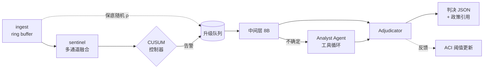

# 05 · 运行栈与 Agent

## 1. 进程拓扑

一条流一个 sentinel 进程；analyst 跨流共享（池化）。



## 2. Ring buffer

- 保留最近 N 秒**原生帧率**原始帧，N 默认 300（5 分钟）
- 存储：内存环形 + 磁盘溢出；按 GOP 对齐，便于压缩域直读
- 作用：sentinel 晚报时仍能回溯取证 → **把"漏报"转成"有界延迟"**

⚠️ 但 ring buffer 只能把**晚报**转成延迟，**不能把"永不报"转成延迟**。
sentinel 零信号的内容滚过去就是硬 miss。这就是保底随机覆盖 ρ 存在的理由。

## 3. Sentinel 循环

```
每 1/f_s 秒（f_s 默认 0.5）:
  1. 从压缩域读 motion/帧类型/码率        # 不解码
  2. 若 motion 能量 < θ 且 embedding delta < ε: 跳过本帧（感知去重）
  3. 否则解码缩略图 → SigLIP2 嵌入 → 与政策原型/案例库算相似度
  4. 合并 ASR/OCR/弹幕 的滚动分数
  5. 融合头 → 连续风险分 s_t
  6. s_t 送入 CUSUM
```

⚠️ 第 2 步的去重是**内容自适应**的，因此是可被对手放大的成本通道：
注入运动噪声就能让去重失效、token 数爆炸。需设**硬上限**：
每分钟解码帧数不超过 `f_s × 60 × 3`，超出则强制降采样并告警。
这是对 cost-amplification attack 的运行时防御（见 `06_EXPERIMENTS.md` §4）。

## 4. CUSUM 控制器

```latex
S_t = \max(0,\; S_{t-1} + \log\frac{p_1(s_t)}{p_0(s_t)}),
\qquad \tau = \inf\{t: S_t \geq h\}
```

- `p_0, p_1`：安全/不安全下风险分的密度，在 `compile` 池上拟合
- `h`：由平均误报间隔 γ 定，`h ≈ log γ`
- **随机化**：采样时刻加抖动 `t_k = k/f_s + U(-δ,δ)`，对抗按采样表定时的对手
- 告警后：突发采样 + 回溯 ring buffer 全分辨率重查

## 5. Analyst Agent

### 5.1 作用域：只在已升级窗口内

全局分配是统计（CUSUM，零成本，有界）；**窗口内**分配才交给 agent。
让 agent 决定全局去哪看，等于把贵模型放回内层循环，且会破坏延迟界。

### 5.2 工具集

| 工具 | 签名 | 实现 |
|---|---|---|
| `zoom` | `(t, bbox) → image` | 全分辨率裁剪 |
| `rewind` | `(t0, t1, fps) → frames` | ring buffer 高帧率重采样 |
| `diff` | `(t0, t1) → summary` | 压缩域变化摘要，便宜 |
| `ocr` | `(t) → text` | RapidOCR |
| `transcribe` | `(t0, t1) → text` | faster-whisper |
| `policy_lookup` | `(query) → clauses` | 政策 RAG |
| `case_lookup` | `(embedding, k) → exemplars` | 案例库检索（`pool="exemplar"`） |

`track()` 不给 VLM 干，外挂 tracker。

### 5.3 循环与预算

```yaml
max_turns: 6
max_tool_calls: 10
budget_tokens: 40000          # 单次升级的硬上限,超出即返回当前最佳判断
timeout_s: 45
```

⚠️ agentic 是多轮的，5 轮就是 10–30 秒。**它天然是回溯性的**，靠 ring buffer
撑着。这段延迟必须计入 `E[τ−ν]`，不能假装是 0。

### 5.4 感知–判断解耦

analyst 被问的是**中性感知问题**（描述可见内容、核验属性），另一步才把描述
对照政策条款。模型从不被要求"engage with"不安全内容。

⚠️ 但描述是**有损瓶颈**，对细微类别可能被自行淡化。describe-then-judge 相对
直接判断的精度差是必做消融（`06_EXPERIMENTS.md` §3.7），不能假定无损。

## 6. 输出契约

```json
{
  "clip_id": "sg2-00001",
  "verdict": "unsafe",
  "category": "C2_sexual",
  "score": 0.83,
  "threshold": 0.71,
  "calibration": {"status": "calibrated", "n": 120, "recall_bound": 0.958},
  "evidence_frames": [63102, 63140],
  "policy_citations": ["SW-C2.3"],
  "escalation_path": ["sentinel", "midtier", "analyst"],
  "latency_ms": {"detect": 1840, "total": 14200},
  "cost": {"api_tokens": 12400, "decoded_frames": 96}
}
```

`calibration` 字段**必填**。状态非 `calibrated` 时 `recall_bound` 必须为 `null`，
不是一个编出来的默认值（见 `03_ADAPTATION.md` §3）。

## 7. 服务

```bash
# 中间层(外部卡)。⚠️ Turing 上必须 --dtype float16
vllm serve Qwen/Qwen3-VL-8B-Instruct --dtype bfloat16 \
    --max-model-len 16384 --limit-mm-per-prompt image=32 --port 8801

# sentinel 直接 torch,不进 vLLM(只有 2M 参数,批量小,进服务反而更慢)
python -m sg2.serve.sentinel --ckpt ckpt/fusion.pt --device cuda:0
```

⚠️ 端口从 compose/配置读，不要用 `docker ps | grep` 猜 —— 这台机器上同时
跑着十几个其他项目的容器。

## 8. 跑一条流

```bash
python -m sg2.run \
  --stream file:///data2/sg2/videos/sg2-00001.mp4 \
  --config configs/default.yaml \
  --out runs/$(date +%Y%m%d-%H%M%S)/
```

产出：`decisions.jsonl`、`trace.jsonl`（每次工具调用）、`cost.json`、
`run.json`（git commit + manifest sha + 各模型版本，用于复现）。
