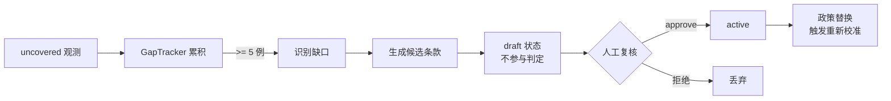

# 09 · 政策语料与 out-of-policy

分类体系继承 **SafeWatch**（ICLR 2025, arXiv:2412.06878），不自造。

## 1. SafeWatch 的六类

| id | 名称 |
| --- | --- |
| `C1_sexual` | Sexual Content |
| `C2_abuse` | Harassment & Bullying |
| `C3_violence` | Threats, Violence & Harm |
| `C4_misinformation` | False & Deceptive Information |
| `C5_illegal` | Illegal/Regulated Activities |
| `C6_extremism` | Hateful Content & Extremism |

`sg2/policy.py` 的 `safewatch_corpus()` 给出基线语料。条款**文本是占位描述**，
原文在 SafeWatch 的 Appendix B.10.1，应从正式发布抄录。

## 2. 政策是结构化数据，不是一段文本

`PolicyClause` 有 id、类别、版本、生命周期、出处。理由是四件事都依赖它：

1. **引用门**要求 flag 指向具体条款，条款得有稳定 id
2. **零日政策**= 往语料里加条款 + 45 个正例重校准，不是重训
3. **out-of-policy** 需要判断"该类别有没有条款"
4. **政策变更 = 校准纪元边界**

### 生命周期

```
draft ──approve(reviewer)──> active ──> deprecated ──> retired
  ↑                                                       │
  └──────────── amend() 生成新版本，旧版转 retired ─────────┘
```

- `draft` / `retired` **不参与判定**，也不可被引用
- `amend()` **不就地改文本**——历史判决引用的是旧 id，就地改会让它们无法复现

## 3. out-of-policy：当前动作空间的一个洞

三元动作 + 引用门合起来，让"明显有害但无条款覆盖"的内容**没有合法输出**：

| 模型只能 | 后果 |
| --- | --- |
| `flag` | 引用门要求 citation，无条款可引 → 奖励清零 |
| `clear` | 它确实有害 |
| `hold` | 永远等下去，事件不闭合 |

结果是模型被逼着**编造引用**（最坏）或**放行**（次坏）。所以加第四个动作：

> `uncovered` = 看起来有害，但现行政策没有覆盖它

它不要求引用（过得了引用门），触发政策补缺流程，在奖励里是独立一档。

### 奖励排序（实测）

| 情形 | 奖励 |
| --- | --- |
| 有条款 → 正确 flag | **+0.974** |
| 无条款 → 正确说未覆盖 | **+0.599** |
| 安全流 → clear | −0.001 |
| 安全流 → 说未覆盖 | −0.301 |
| 无条款 → 沉默 | −0.501 |
| 无条款 → **编造引用** | −0.801 |
| 有条款 → 说未覆盖（偷懒） | **−0.901** |

两个结构性约束，构造时即拒绝：

- `gamma_uncovered_right < gamma_hit` —— 否则"一律说未覆盖"比认真引用更划算
- 有条款却说未覆盖，罚得比编造引用还重 —— 这是最该压住的偷懒行为

## 4. 政策补缺流程



两道闸门，都写进了代码而非文档：

1. **单点不构成缺口**（`MIN_CASES = 5`）——一例很可能只是误判
2. **生成的条款不得直接 active**——`PolicyClause.__post_init__` 强制。
   自动生成并自动启用审核政策，等于让系统在无人知晓的情况下改变判定范围。
   唯一路径是 `approve(reviewer=...)`，且必须记录复核人。

## 5. 政策替换与重新校准

`swap_policy()` 返回是否需要重校准。判据是**指纹**，而指纹只对生效条款的
`(id, text)` 哈希，**与顺序无关**：

| 变更 | 需重校准 |
| --- | --- |
| 加/删/改条款 | ✅ 判定范围变了 |
| 只调条款顺序（缓解位置偏置） | ❌ 判定范围没变 |

## 6. 位置偏置：实测存在，且有个便宜的解法

SafeWatch 实测基线 MLLM 的注意力与政策位置**强相关（|ρ| = 0.90）**，
它用 PEPE（Parallel Equivalent Policy Encoding，给各政策块相同 RoPE）
压到 ≤1%。

我们包的是冻结模型，改不了 RoPE，只能在输入侧换顺序。
`PolicyConfig.shuffle_scope`：

| 取值 | 偏置 | KV 前缀缓存 |
| --- | --- | --- |
| `never` | 承受 | 最优 |
| `event`（默认） | 事件间平均掉 | 事件内有效 |
| `tick` | 最小 | 全失效 |

**代价是明确的**：换顺序 = 换 prompt 文本 = 缓存失效。默认 `event` 是折中。

### 实测：渲染格式会泄漏进输出

用 Qwen3-VL-2B 实测出三种引用错误，都不是"模型不听话"，而是**渲染格式泄漏**：

| 模型输出 | 原因 | 修法 |
| --- | --- | --- |
| `"[C1_sexual]"` | 渲染时用 `[id]` 包裹，被连方括号抄走 | 渲染改 `id=C1_sexual`；解析侧归一化 |
| `"1"` | 抄了行首序号 | 渲染默认**不编号** |
| `"C1"` | 截断成前缀 | `resolve_citation()` 接受唯一前缀，歧义则拒 |

> 去掉方括号后有个意外收获：**位置偏置消失了**。同一语料 5 种顺序，
> 修改前引用漂移出 2 种结果，修改后 5 次全部一致。id 更醒目之后，
> 模型不再靠位置猜。

`resolve_citation()` 返回失败原因（`exact` / `prefix` / `ordinal` /
`ambiguous_prefix` / `unknown` / `not_enforced` / `empty`），
便于统计模型到底错在哪一类，而不是笼统地记一个"引用非法"。

## Sources

- [SafeWatch: An Efficient Safety-Policy Following Video Guardrail Model](https://arxiv.org/html/2412.06878v1)（ICLR 2025）
- [SafeWatch 官方实现](https://github.com/BillChan226/SafeWatch)
